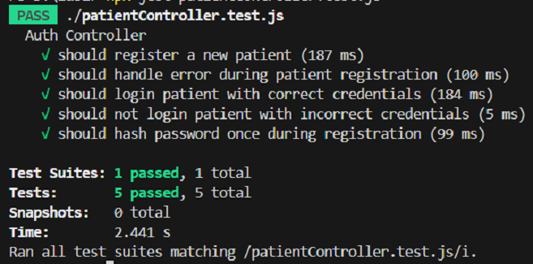
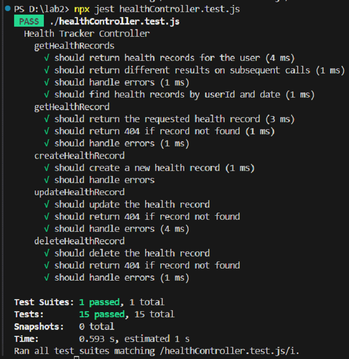

# 🧪 Express Controller Unit Testing with Jest

> A backend testing repository demonstrating comprehensive unit testing of Express.js controllers using Jest, Sinon, and advanced mocking techniques. Created as Lab 2 for the "Methods of Software Specification and Verification" course at Taras Shevchenko National University of Kyiv.

---

## 🛠️ Tech Stack & Tools
- **Language:** JavaScript (Node.js)
- **Framework:** Express.js
- **ORM:** Sequelize (PostgreSQL)
- **Testing Libraries:** Jest, Supertest, Sinon

---

## ⚙️ Project Overview & Architecture
This project features two main controllers designed for a healthcare management application:
1. **`PatientController`:** Handles user registration (with password hashing via `bcryptjs`) and authentication (issuing JSON Web Tokens).
2. **`HealthController`:** Implements full CRUD operations for patient health records, ensuring proper user authorization and data scoping.

### Advanced Testing Strategies Implemented
- **Comprehensive Mock Scenarios:** Every mocked method (e.g., `findAll`, `findOne`, `create`) includes at least three distinct test scenarios:
  - **Success Case:** Validating normal execution and expected outputs.
  - **Not Found Case:** Handling empty or null results (`404` responses).
  - **Exception Handling:** Simulating database errors and rejection handling (`500` responses).
- **Call Verification & Matchers:** Verifying that specific methods are called exact numbers of times (`toHaveBeenCalledTimes`) and with expected parameters using advanced matchers like `expect.stringContaining()`.
- **Sequential Mocking:** Utilizing `mockResolvedValueOnce()` to simulate changing states or different responses on consecutive function calls.

---

## 📸 Test Results & Verification
1. Patient Controller Test SuiteExecution results for patientController.test.js, verifying authentication flows, registration, and password hashing security.  

2. Health Controller Test SuiteExecution results for healthController.test.js, demonstrating 15 passing tests covering complex sequential mock resolutions, parameter matchers, and error handling.

